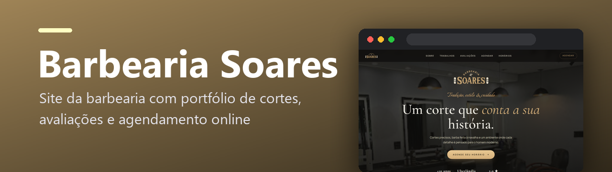
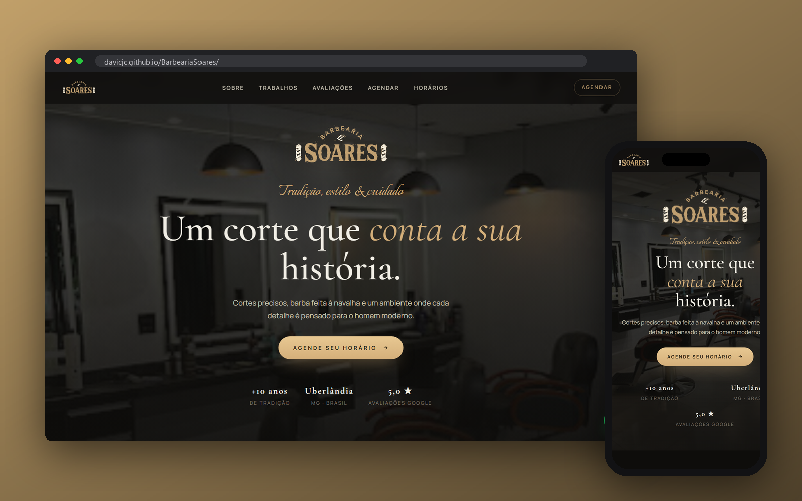

  

  
  
  
  
  

Site da Barbearia Soares (Uberlândia): serviços e preços, galeria de cortes, avaliações e agendamento online direto pelo WhatsApp.

  

---

## ✨ O que tem

| | |
|---|---|
| 💈 **Apresentação** | “Um corte que conta a sua história” — tradição, +10 anos e nota 5,0 no Google em destaque |
| ✂️ **Serviços com preço e duração** | Cortes, barba, barboterapia, sobrancelha, pigmentação, hidratação, alisamento e combos |
| 🧔 **Escolha do barbeiro** | Ou “qualquer um” disponível |
| 📅 **Agendamento online** | O cliente escolhe serviço, barbeiro, dia e horário; o site monta a mensagem e abre o **WhatsApp** da barbearia |
| 🖼️ **Galeria de trabalhos** | “O resultado fala por si só” |
| ⭐ **Avaliações** | Depoimentos dos clientes |
| 🕘 **Horários e localização** | Tudo para o cliente chegar |

## 🚀 Como rodar

É um site estático: abra o `index.html` no navegador ou publique em qualquer hospedagem estática (está no GitHub Pages). Para mudar serviços, preços, barbeiros e o número do WhatsApp, edite as listas no começo do `script.js`.

## 🗂️ Estrutura

| Arquivo | O que é |
|---|---|
| `index.html` | estrutura da página |
| `style.css` | identidade visual (preto e dourado) e responsividade |
| `script.js` | serviços, barbeiros, fluxo de agendamento e animações |
| `assets/` | logo e fotos |

---

Desenvolvido por <a href="https://github.com/Davicjc">Davi Castro</a> · <a href="https://davicjc.com">davicjc.com</a> para Barbearia Soares

